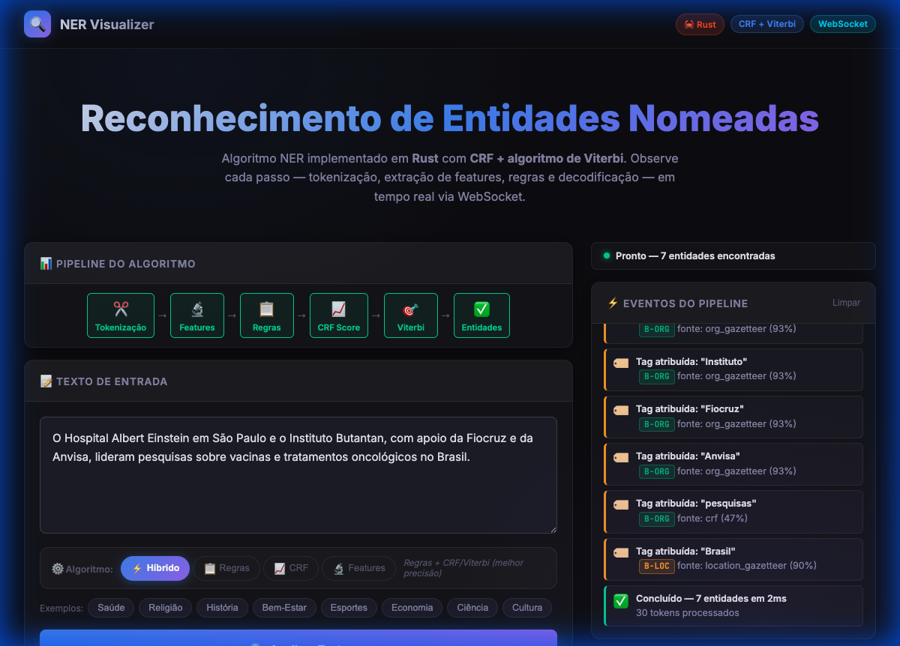
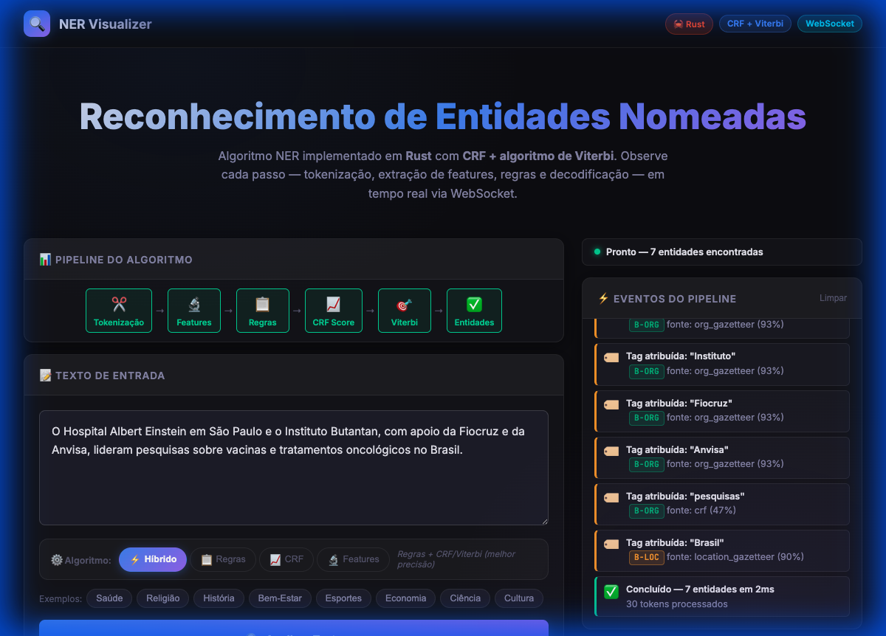
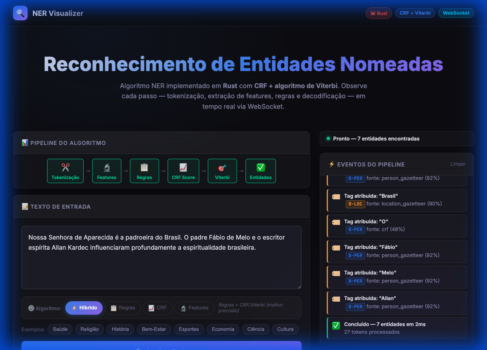
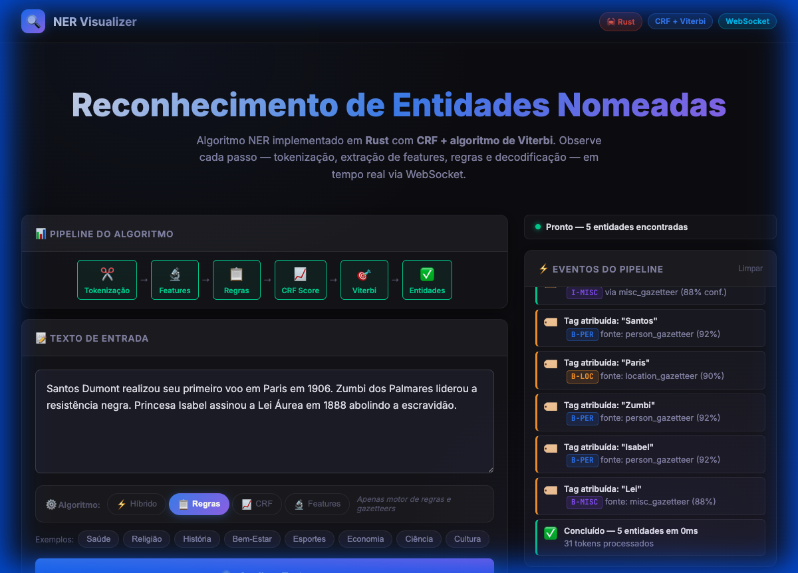

<div align="center">

# 🔍 NER Visualizer

**Reconhecimento de Entidades Nomeadas em Português Brasileiro**

[](https://www.rust-lang.org/)
[](https://github.com/tokio-rs/axum)
[](https://developer.mozilla.org/en-US/docs/Web/API/WebSockets_API)
[](LICENSE)
[](#testes)

*Sistema NER didático que combina **Motor de Regras** + **CRF** + **Viterbi**, com visualização passo-a-passo em tempo real via WebSocket.*



</div>

---

## ✨ Funcionalidades

| Funcionalidade | Descrição |
|---|---|
| 🧩 **Pipeline Expandido** | Regras · CRF · HMM · MaxEnt · Perceptron · Span-based |
| ⚡ **Tempo Real** | Eventos do pipeline transmitidos via WebSocket — passo a passo |
| 🎛️ **8 Modos de Algoritmo** | Hybrid · Rules · CRF · HMM · MaxEnt · Perceptron · Span · Features |
| 🔠 **5 Tokenizadores** | Standard · Char-level · Aggressive · Conservative · BPE-lite |
| 🌐 **Corpus PT-BR** | 40+ textos anotados: Saúde · Religião · História · Bem-Estar · Esportes |
| 📊 **Tabela Viterbi** | Visualização das probabilidades de transição token a token |
| 🎨 **UI Premium** | Dark mode · glassmorphism · animações suaves |

---

## 📸 Demonstrações Visuais

### Análise de Textos de Saúde — Modo Híbrido

> Hospital Albert Einstein, Instituto Butantan, Fiocruz, Anvisa, São Paulo, Brasil identificados como ORG e LOC



---

### Análise de Religião — Pessoas e Entidades Espirituais

> Nossa Senhora de Aparecida (PER) · Fábio de Melo (PER) · Allan Kardec (PER) · Brasil (LOC)



---

### Modo Regras + Texto de História Brasileira

> Santos Dumont (PER) · Paris (LOC) · Zumbi dos Palmares (PER) · Princesa Isabel (PER) · Lei Áurea (MISC)



---

## 🗂️ Categorias de Entidades

```
👤 PER  (Pessoa)         — Santos Dumont • Fábio de Melo • Allan Kardec
🏢 ORG  (Organização)    — Fiocruz • Anvisa • Instituto Butantan • Petrobras
📍 LOC  (Local)          — São Paulo • Brasil • Paris • Rio de Janeiro
🏷️ MISC (Miscelânea)     — Covid-19 • Lei Áurea • Candomblé • Umbanda
```

---

## 🎛️ Modos de Algoritmo

O sistema suporta 8 estratégias de reconhecimento:

| Modo | Descrição |
|---|---|
| **Híbrido** | ⚡ Combina Regras + CRF/Viterbi (melhor precisão) |
| **HMM** | 🎲 Hidden Markov Model (Probabilístico Genarativo) |
| **MaxEnt** | ⚖️ Maximum Entropy / Regressão Logística (Discriminativo) |
| **Perceptron** | 🧠 Averaged Perceptron (Discriminativo Online) |
| **Span-based** | 📏 Classificação de trechos (Span) para entidades aninhadas/longas |
| **Regras** | 📋 Apenas gazetteers e padrões regex |
| **CRF** | 📈 Apenas CRF + Viterbi (sem regras) |
| **Features** | 🔬 Apenas tokenização + extração de features |

### Tokenização

O usuário também pode escolher entre **5 estratégias de tokenização** na interface (Char-level, Aggressive, etc.) para lidar com diferentes morfologias.

### Protocolo WebSocket

O frontend envia JSON com o modo e tokenizador escolhidos:

```json
{ 
  "text": "Santos Dumont chegou em Paris.", 
  "mode": "hmm",
  "tokenizer_mode": "standard"
}
```

Valores de `mode`: `hybrid` · `rules_only` · `crf_only` · `features_only` · `hmm` · `max_ent` · `perceptron` · `span_based`

---

## 🏗️ Arquitetura do Pipeline

```
Texto de Entrada
      │
      ▼
┌─────────────┐    ┌─────────────┐    ┌──────────────┐    ┌───────────┐    ┌──────────┐
│ Tokenização │───▶│  Features   │───▶│    Regras    │───▶│  CRF Score│───▶│  Viterbi │
│  (unicode)  │    │ (cap,pref,  │    │ (gazetteers  │    │ (emissão  │    │ (sequên- │
│             │    │  suf,ctx)   │    │  + regex)    │    │  + trans) │    │  cia ótim│
└─────────────┘    └─────────────┘    └──────────────┘    └───────────┘    └──────────┘
                                                                                  │
                                                                                  ▼
                                                                       ┌────────────────┐
                                                                       │   Entidades    │
                                                                       │  (BIO → spans) │
                                                                       └────────────────┘
```

Cada passo emite um **`PipelineEvent`** via WebSocket para visualização em tempo real.

---

## 📦 Estrutura do Projeto

```
ner/
├── Cargo.toml              # Workspace root
├── ner-core/               # Biblioteca NER (sem deps web)
│   ├── src/
│   │   ├── lib.rs          # Re-exports públicos
│   │   ├── tokenizer.rs    # Tokenizador PT-BR (unicode)
│   │   ├── features.rs     # Extração de features por token
│   │   ├── tagger.rs       # Esquema BIO + EntitySpan
│   │   ├── crf.rs          # Modelo CRF Linear-Chain
│   │   ├── viterbi.rs      # Decodificador de Viterbi
│   │   ├── rule_based.rs   # Motor de regras (gazetteers + regex)
│   │   ├── model.rs        # Pesos CRF + gazetteers pré-treinados
│   │   ├── pipeline.rs     # Orquestrador + AlgorithmMode
│   │   └── corpus.rs       # Corpus PT-BR anotado (BIO)
└── ner-web/                # Aplicação web (Axum + HTMX + WebSocket)
    ├── src/
    │   ├── main.rs         # Servidor Axum + handler WebSocket
    │   └── templates/
    │       └── index.html  # UI (dark mode, glassmorphism)
```

---

## 🚀 Como Executar

### Pré-requisitos

- [Rust 1.75+](https://rustup.rs/)

### Build e Execução

```bash
# Clonar o repositório
git clone https://github.com/charlenopires/ner.git
cd ner

# Executar o servidor (modo dev)
cargo run --bin ner-web

# Acesse: http://localhost:3000
```

### Testes

```bash
cargo test
# Running 25 tests ... test result: ok. 25 passed; 0 failed
```

### Build de Produção

```bash
cargo build --release
./target/release/ner-web
```

---

## 🧪 Corpus PT-BR

O corpus cobre **8 domínios** com 40+ frases anotadas no esquema BIO:

| Domínio | Frases | Entidades Exemplares |
|---|---|---|
| 🏥 Saúde | 6 | Fiocruz, Anvisa, Drauzio Varella, OMS |
| 🕊️ Bem-Estar | 4 | Ana Paula Torres, Parque Cantareira |
| ⛪ Religião | 6 | Nossa Senhora de Aparecida, Allan Kardec, Candomblé |
| 📜 História | 7 | Dom Pedro I, Tiradentes, Zumbi, Lei Áurea |
| 💰 Economia | 4 | Petrobras, Vale, Embraer, Banco Central |
| ⚽ Esportes | 4 | Pelé, Ayrton Senna, Beatriz Souza, Maracanã |
| 🔬 Ciência | 3 | INPE, USP, Nubank, Amazônia-1 |
| 🎭 Cultura | 2 | Jorge Amado, Carmen Miranda |

---

## 🛠️ Stack Tecnológica

| Camada | Tecnologia |
|---|---|
| **Linguagem** | [Rust](https://www.rust-lang.org/) |
| **Web framework** | [Axum](https://github.com/tokio-rs/axum) |
| **Async runtime** | [Tokio](https://tokio.rs/) |
| **Frontend** | HTML + Vanilla JS + WebSocket API |
| **Serialização** | [Serde JSON](https://serde.rs/) |
| **Regex** | [regex crate](https://crates.io/crates/regex) |
| **Unicode** | [unicode-segmentation](https://crates.io/crates/unicode-segmentation) |
| **NER Model** | CRF Linear-Chain + Viterbi (heurístico) |

---

## 📄 Licença

MIT © [charlenopires](https://github.com/charlenopires)
